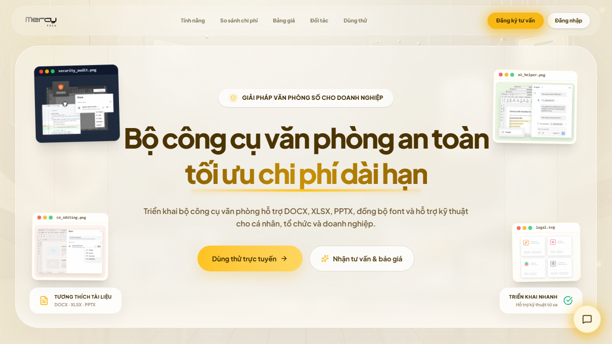
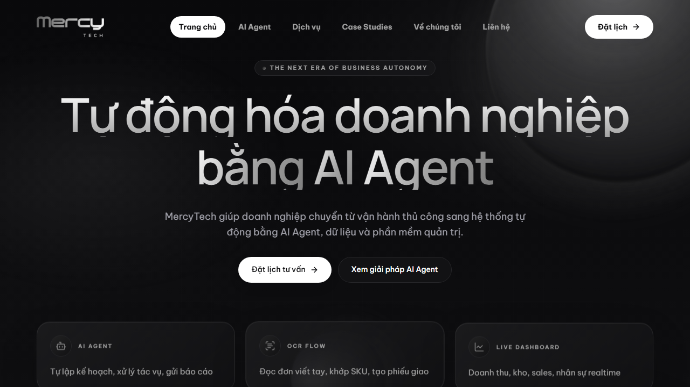
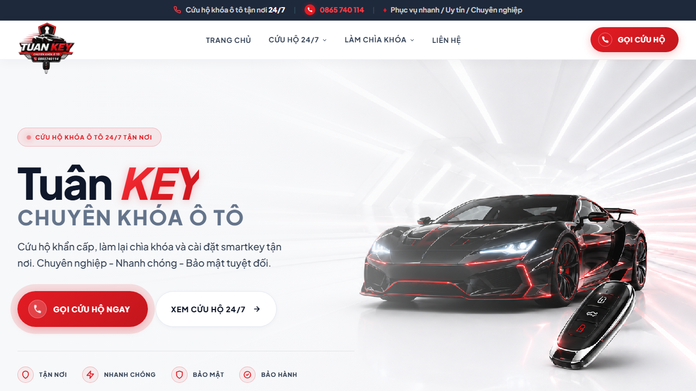
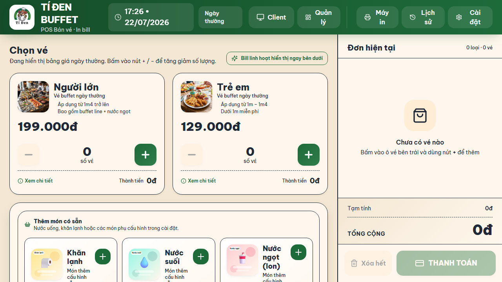
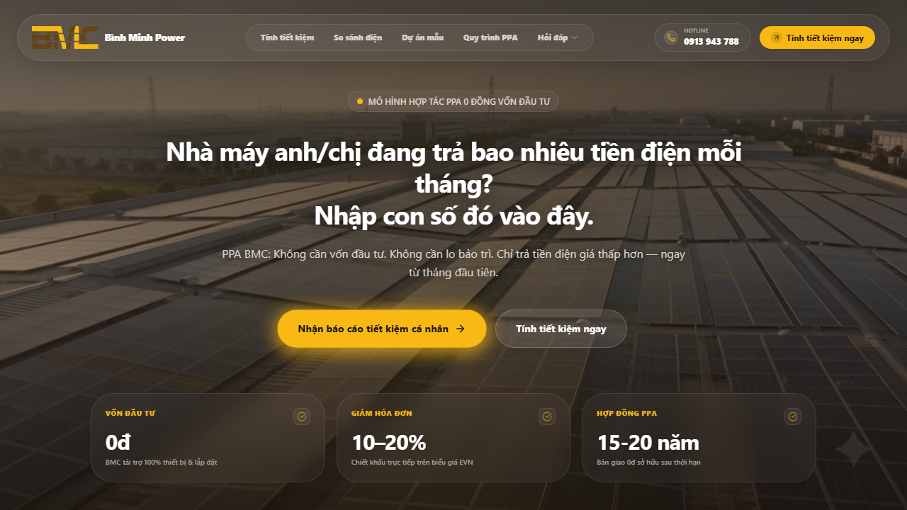
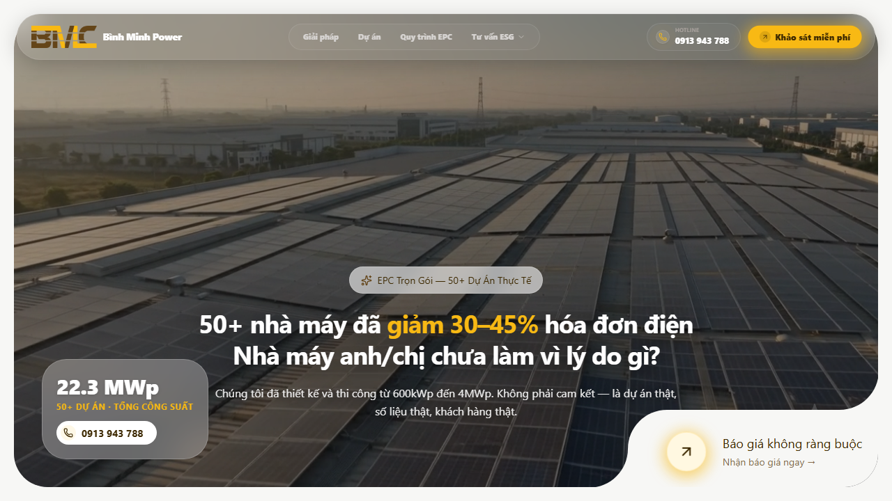
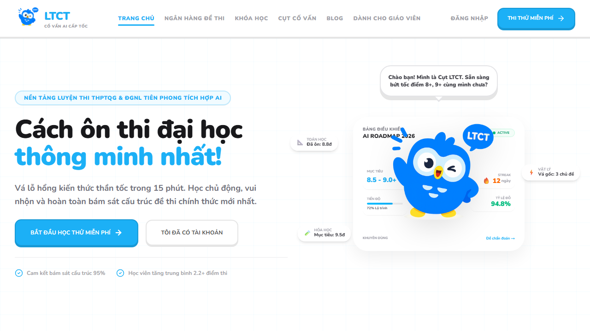
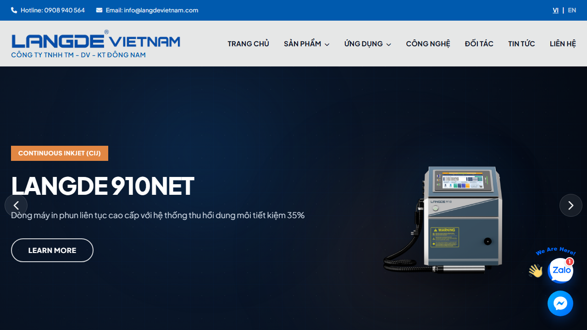
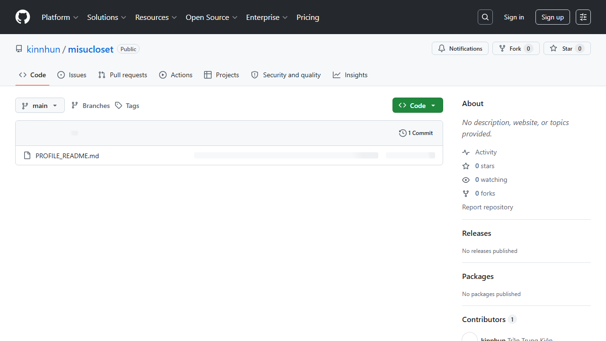
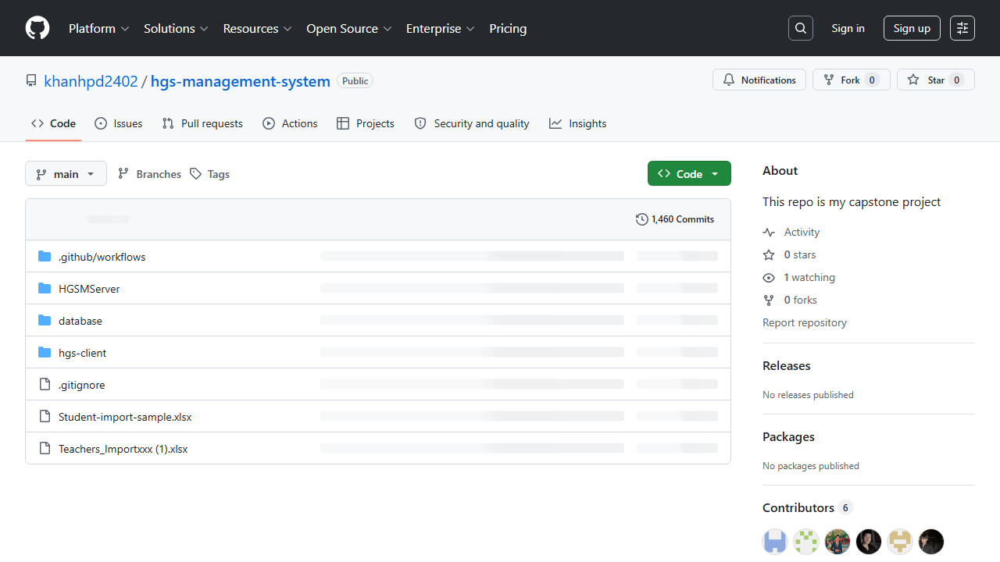

<div align="center">

  <!-- Dynamic Typing Header Banner -->
  <a href="https://zalo.me/0862497002" target="_blank" rel="noopener noreferrer">
    
  </a>

  <p align="center">
    <strong> FULLSTACK WEB & AI DEVELOPER • BAZIL.FR AVANT-GARDE DESIGN </strong><br/>
    <sub>Next.js 15 App Router | Tailwind CSS v4 | Gemini AI Integration | SEO Audit 98+</sub>
  </p>

  <!-- Interactive Badges Row -->
  <p align="center">
    <a href="https://zalo.me/0862497002" target="_blank" rel="noopener noreferrer">
      
    </a>
    <a href="https://www.facebook.com/trantrungkien.webai" target="_blank" rel="noopener noreferrer">
      
    </a>
    
    
    
  </p>

</div>

<br/>

---

###  ABOUT THE STUDIO (Giới Thiệu & Năng Lực)

```yaml
studio_profile:
  developer: Trần Trung Kiên (kinnhun)
  role: Fullstack Web & AI Developer / Automation Specialist
  design_aesthetic: "Bazil.fr Avant-Garde • Dark Obsidian Glassmorphism • High Motion"
  contact_zalo: "0862 497 002"
  facebook_page: "https://www.facebook.com/trantrungkien.webai"
  core_stack:
    frontend: Next.js 15, React 19, TypeScript, Tailwind CSS v4, motion/react
    backend: Node.js, Express, Python Automation, REST API
    ai_data: Gemini AI, OpenAI LLM, PostgreSQL, MongoDB, Redis, Docker
  services:
    - 01. Thiết kế Website doanh nghiệp & Landing Page chuẩn SEO (PageSpeed 95+)
    - 02. Web Application & SaaS Dashboard (Next.js App Router, Tailwind v4)
    - 03. Tích hợp AI Assistant, Chatbot LLM & Tool tự động hóa (Python Bot)
    - 04. Xây dựng Hệ thống License Key & ERP Doanh nghiệp
```

---

###  TECH STACK & AI ARCHITECTURE

<div align="center">

<a href="https://skillicons.dev">
  
</a>

<br/><br/>

| Mảng Công Nghệ | Tech Badges & Frameworks |
| :--- | :--- |
| **Frontend & UI/UX** |      |
| **Backend & Automation** |     |
| **AI Integration & LLM** |    |
| **Database & Cloud** |      |

</div>

---

###  VISUAL SHOWCASE — DỰ ÁN TIÊU BIỂU (150+ PROJECTS)

#### 🏢 1. Doanh Nghiệp, Bản Quyền & ERP Systems

<div align="center">

| Hình Ảnh Minh Họa Thực Tế | Dự Án & Chi Tiết Công Nghệ | Đường Dẫn Truy Cập (Mở Tab Mới) |
| :---: | :--- | :---: |
| <a href="https://onlyoffice.mercytechglobal.com/" target="_blank" rel="noopener noreferrer"></a> | **Mercy Keys — License & Authorization Management**<br/>• Quản lý bản quyền & cấp phép phần mềm OnlyOffice tự động.<br/>• Tích hợp sinh key mã hóa, quản lý khách hàng doanh nghiệp.<br/>• **Tech:** `Next.js` `TypeScript` `Tailwind` `PostgreSQL` | <a href="https://onlyoffice.mercytechglobal.com/" target="_blank" rel="noopener noreferrer"></a><br/><sub style="font-size:11px;"><a href="https://onlyoffice.mercytechglobal.com/" target="_blank" rel="noopener noreferrer">onlyoffice.mercytechglobal.com ↗</a></sub> |
| <a href="https://mercytechglobal.com/" target="_blank" rel="noopener noreferrer"></a> | **Mercy Tech Global Corporate Portal**<br/>• Portal chính thức của tập đoàn công nghệ Mercy Tech Global.<br/>• Giao diện Glassmorphism hiện đại, tối ưu SEO 98/100.<br/>• **Tech:** `Next.js App Router` `Framer Motion` `SEO Standard` | <a href="https://mercytechglobal.com/" target="_blank" rel="noopener noreferrer"></a><br/><sub style="font-size:11px;"><a href="https://mercytechglobal.com/" target="_blank" rel="noopener noreferrer">mercytechglobal.com ↗</a></sub> |
| <a href="https://www.tuankey.com/" target="_blank" rel="noopener noreferrer"></a> | **TuanKey System — Key Distribution**<br/>• Nền tảng phân phối & quản lý License key tự động 100%.<br/>• Tích hợp hệ thống thanh toán tự động & quản lý API.<br/>• **Tech:** `Web App` `Node.js` `Automation` `Payment API` | <a href="https://www.tuankey.com/" target="_blank" rel="noopener noreferrer"></a><br/><sub style="font-size:11px;"><a href="https://www.tuankey.com/" target="_blank" rel="noopener noreferrer">tuankey.com ↗</a></sub> |
| <a href="https://app-buffet.vercel.app/" target="_blank" rel="noopener noreferrer"></a> | **App Buffet Manager — Smart Restaurant Platform**<br/>• Web App quản lý nhà hàng & đặt món Buffet thông minh.<br/>• Quản lý sơ đồ bàn, menu món & thống kê doanh thu real-time.<br/>• **Tech:** `Next.js` `React` `Tailwind CSS` `Vercel` | <a href="https://app-buffet.vercel.app/" target="_blank" rel="noopener noreferrer"></a><br/><sub style="font-size:11px;"><a href="https://app-buffet.vercel.app/" target="_blank" rel="noopener noreferrer">app-buffet.vercel.app ↗</a></sub> |

</div>

<br/>

#### ⚡ 2. Năng Lượng & CBAM Carbon (Bình Minh Power Ecosystem)

<div align="center">

| Hình Ảnh Minh Họa Thực Tế | Dự Án & Chi Tiết Công Nghệ | Đường Dẫn Truy Cập (Mở Tab Mới) |
| :---: | :--- | :---: |
| <a href="https://ppa.binhminhpower.com/" target="_blank" rel="noopener noreferrer"></a> | **PPA Bình Minh Power — Direct Power Purchase**<br/>• Hệ thống Quản lý & Hợp đồng Mua bán Điện Trực tiếp (PPA).<br/>• Số hóa hợp đồng điện năng lượng mặt trời cho doanh nghiệp.<br/>• **Tech:** `Next.js` `Tailwind CSS` `Energy Management` | <a href="https://ppa.binhminhpower.com/" target="_blank" rel="noopener noreferrer"></a><br/><sub style="font-size:11px;"><a href="https://ppa.binhminhpower.com/" target="_blank" rel="noopener noreferrer">ppa.binhminhpower.com ↗</a></sub> |
| <a href="https://cbam.mercytechglobal.com/" target="_blank" rel="noopener noreferrer"></a> | **CBAM Carbon Management — International Carbon Accounting**<br/>• Nền tảng Kiểm kê & Tính toán Tải lượng Carbon CBAM xuất khẩu EU.<br/>• Đáp ứng quy chuẩn khí thải quốc tế & báo cáo tự động.<br/>• **Tech:** `Next.js` `Python Analytics` `Carbon CBAM` | <a href="https://cbam.mercytechglobal.com/" target="_blank" rel="noopener noreferrer"></a><br/><sub style="font-size:11px;"><a href="https://cbam.mercytechglobal.com/" target="_blank" rel="noopener noreferrer">cbam.mercytechglobal.com ↗</a></sub> |
| <a href="https://epc.binhminhpower.com/" target="_blank" rel="noopener noreferrer"></a> | **EPC Bình Minh Power — Solar Project Engineering**<br/>• Hệ thống Quản lý Dự án Thiết kế, Mua sắm & Thi công Năng lượng EPC.<br/>• Quản lý tiến độ công trình, vật tư & chất lượng dự án.<br/>• **Tech:** `Web App` `PostgreSQL` `SaaS Dashboard` | <a href="https://epc.binhminhpower.com/" target="_blank" rel="noopener noreferrer"></a><br/><sub style="font-size:11px;"><a href="https://epc.binhminhpower.com/" target="_blank" rel="noopener noreferrer">epc.binhminhpower.com ↗</a></sub> |

</div>

<br/>

#### 🎓 3. Giáo Dục, Văn Hóa & Thương Mại Điện Tử

<div align="center">

| Hình Ảnh Minh Họa Thực Tế | Dự Án & Chi Tiết Công Nghệ | Đường Dẫn Truy Cập (Mở Tab Mới) |
| :---: | :--- | :---: |
| <a href="https://www.luyenthicaptoc.vn/" target="_blank" rel="noopener noreferrer"></a> | **Luyện Thi Cấp Tốc — EdTech Exam Prep Platform**<br/>• Nền tảng học & ôn thi trực tuyến tối ưu trải nghiệm học viên.<br/>• Ngân hàng đề thi trắc nghiệm thông minh, tính điểm tức thì.<br/>• **Tech:** `React` `Next.js` `SEO High Score` | <a href="https://www.luyenthicaptoc.vn/" target="_blank" rel="noopener noreferrer"></a><br/><sub style="font-size:11px;"><a href="https://www.luyenthicaptoc.vn/" target="_blank" rel="noopener noreferrer">luyenthicaptoc.vn ↗</a></sub> |
| <a href="https://langdevietnam.com/" target="_blank" rel="noopener noreferrer"></a> | **Làng Đề Việt Nam — Cultural Heritage Portal**<br/>• Trang thông tin văn hóa & di sản làng nghề Việt Nam chuẩn SEO Google.<br/>• Tải trang cực nhanh, tối ưu cấu trúc schema dữ liệu di sản.<br/>• **Tech:** `Next.js` `SEO Optimization` `Responsive` | <a href="https://langdevietnam.com/" target="_blank" rel="noopener noreferrer"></a><br/><sub style="font-size:11px;"><a href="https://langdevietnam.com/" target="_blank" rel="noopener noreferrer">langdevietnam.com ↗</a></sub> |
| <a href="https://github.com/kinnhun/misucloset" target="_blank" rel="noopener noreferrer"></a> | **MISU Closet — Modern E-Commerce Platform**<br/>• Nền tảng E-Commerce thời trang hiện đại & mượt mà.<br/>• Quản lý sản phẩm, giỏ hàng & thanh toán trực tuyến.<br/>• **Tech:** `Next.js` `Tailwind CSS` `TypeScript` | <a href="https://github.com/kinnhun/misucloset" target="_blank" rel="noopener noreferrer"></a><br/><sub style="font-size:11px;"><a href="https://github.com/kinnhun/misucloset" target="_blank" rel="noopener noreferrer">github/misucloset ↗</a></sub> |
| <a href="https://github.com/khanhpd2402/hgs-management-system" target="_blank" rel="noopener noreferrer"></a> | **HGS Management — School & Academy ERP System**<br/>• Hệ thống quản lý trường học & đào tạo trực tuyến toàn diện.<br/>• Phân quyền giáo viên, học sinh, điểm số & học phí.<br/>• **Tech:** `React` `Node.js` `MongoDB` `Express` | <a href="https://github.com/khanhpd2402/hgs-management-system" target="_blank" rel="noopener noreferrer"></a><br/><sub style="font-size:11px;"><a href="https://github.com/khanhpd2402/hgs-management-system" target="_blank" rel="noopener noreferrer">github/hgs-management ↗</a></sub> |

</div>

---

###  GITHUB METRICS & ANALYTICS

<div align="center">

<table border="0">
  <tr>
    <td width="50%" align="center">
      
    </td>
    <td width="50%" align="center">
      
    </td>
  </tr>
</table>

<p align="center">
  
</p>

</div>

---

###  LIÊN HỆ HỢP TÁC & TƯ VẤN DỰ ÁN

<div align="center">

<a href="https://zalo.me/0862497002" target="_blank" rel="noopener noreferrer">
  
</a>
<a href="https://www.facebook.com/trantrungkien.webai" target="_blank" rel="noopener noreferrer">
  
</a>
<a href="https://www.facebook.com/kin2901" target="_blank" rel="noopener noreferrer">
  
</a>

<br/><br/>


</div>
